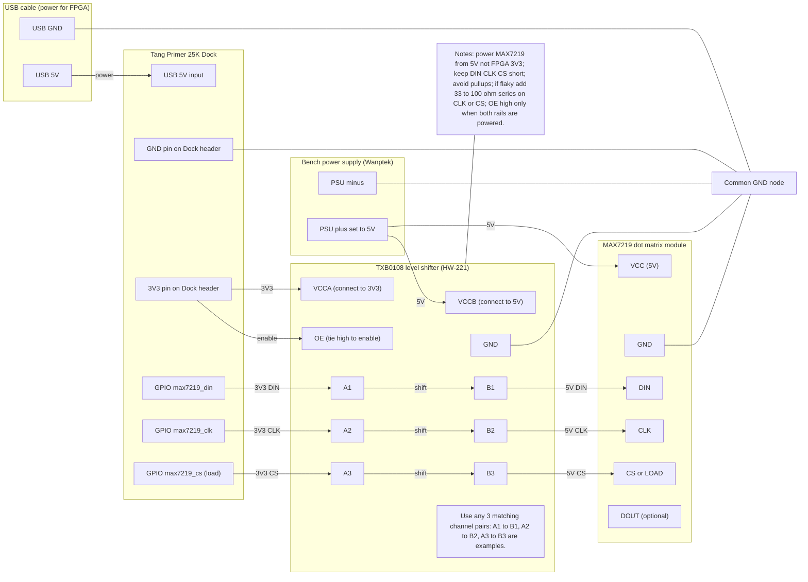

# MAX7219 Dot-Matrix Wiring (via TXB0108 Level Shifter, HW-221)

This document describes how to connect a Tang Primer 25K Dock (3.3V GPIO) to a MAX7219 LED dot-matrix module (typically powered at 5V) using a TXB0108-based bidirectional level shifter breakout (often sold as HW-221).

The MAX7219 uses a 3-wire, SPI-like interface:
- `DIN` (data in)
- `CLK` (clock)
- `CS` / `LOAD` (chip select / latch)

## What DIN / CLK / CS / LOAD Mean (software-friendly)

Think of the MAX7219 interface like writing a tiny "packet" to a peripheral:

- `DIN` (data in): the bitstream you are sending to the MAX7219.
  - The FPGA drives this line.
  - The MAX7219 samples it on clock edges.

- `CLK` (clock): provides timing so both sides agree when each bit is valid.
  - Each clock pulse transfers one bit.
  - With MAX7219, data is typically sampled on the rising edge of `CLK` (SPI-like behavior).

- `CS` / `LOAD` (chip select / load): a framing and latch signal.
  - "Chip select" part: when `CS` is asserted (typically LOW), the MAX7219 pays attention to `CLK` and `DIN`.
  - "Load" part: when `CS` deasserts (goes HIGH), the MAX7219 **latches** what you just sent and applies it.
  - Many MAX7219 boards label this pin `CS` or `LOAD`; functionally it is the same idea.

What does "latch" mean here?
- While `CS` is LOW, the MAX7219 is shifting bits into an internal shift register (like building up a 16-bit word).
- When `CS` goes HIGH, the MAX7219 copies that 16-bit word into its active register (the thing that actually affects the display).

The MAX7219 "packet" size is 16 bits per write:
- 8-bit address (which register / digit row you are writing)
- 8-bit data (the value for that register / row)

Typical transaction (conceptually):
```text
CS/LOAD:  ____----------------____----------------____
CLK:      ____|¯|_|¯|_|¯|_|¯|_ ... _|¯|________________   (16 pulses while CS is LOW)
DIN:      ____ b15 b14 ... b1 b0 ______________________

Meaning: assert CS (LOW), clock 16 bits on DIN, then deassert CS (HIGH) to latch.
```

Software analogy:
- `CS/LOAD` is like "begin frame" and "commit frame".
- `CLK` is like the serializer's tick that advances the bit position.
- `DIN` is the payload bits.

## Mermaid Wiring Diagram



## Pin/Net Checklist (quick)

- TXB0108 `VCCA` -> FPGA `3.3V`
- TXB0108 `VCCB` -> `5V` (same 5V as MAX7219 module)
- TXB0108 `GND` -> common `GND` (FPGA + shifter + module)
- TXB0108 `OE` -> `3.3V` (enabled) or a controlled FPGA pin (enabled after rails are stable)
- TXB0108 `A1` -> FPGA `DIN` GPIO, `B1` -> MAX7219 `DIN`
- TXB0108 `A2` -> FPGA `CLK` GPIO, `B2` -> MAX7219 `CLK`
- TXB0108 `A3` -> FPGA `CS/LOAD` GPIO, `B3` -> MAX7219 `CS/LOAD`

Tang Primer 25K Dock specifics:
- Power the Dock from USB (normal).
- Take `3V3` and `GND` from any Dock header pins labeled `3V3` and `GND` (2x20 header or PMOD).
- Tie Dock `GND` to the bench supply `-` (ground reference only).
- Do not connect bench `+5V` to the Dock `+5V` unless you have verified the Dock supports being powered/back-powered that way.

## Notes About Direction

For MAX7219 control, the FPGA is the only driver:
- FPGA drives `DIN`, `CLK`, `CS/LOAD` (outputs).
- MAX7219 does not drive those lines back.

So while the TXB0108 is bidirectional, treat these as **A-side input from FPGA, B-side output to module** (A->B in practice).

If you tell me your exact Tang board model and which header pins you want to use, I can add a concrete pin mapping (constraints) for your board.
